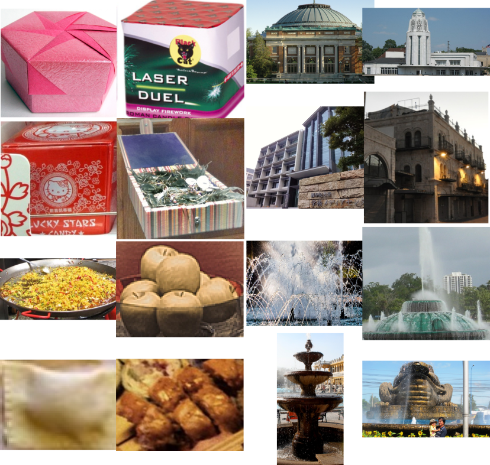

# open-images-512-13M Dataset Generator

This repository provides code to generate base, query and learning embeddings for similarity search benchmarking 
and evaluation on high-dimensional vectors. The dataset is specially designed to benchmark streaming similarity search 
methods under natural data distribution shifts [[1]](#1).

We use CLIP [[2]](#2) to generate 512-dimensional vectors from image crops of the Google's Open 
Images dataset [[3]](#3). We use the provided class labels to organize the vectors in semantical classes
that have different distributions, as evidenced by the 2D Principal Component Analysis projections of 
vectors sampled from four classes (see Figure below). For example, vectors from fountain are close to 
those from building as these images often display buildings. Therefore, by using the provided class 
labels, we can generate a data stream where the distribution of the embedding vectors evolves over time 
(see [[1]](#1) for details about the simulation protocol).

<p align="center">

</p>

The metric for similarity search used with this dataset is inner product [[2]](#2). 


## Steps to generate the dataset

The script [open-images-dataset-13M-1M.py](open-images-dataset-13M-1M.py) generates both the 
13M and 1M versions of the dataset. The corresponding ground-truth files 
(available [here](groundtruth)) are generated conducting an exhaustive 
search with the inner product metric.

Here is a summary of the **steps to generate this dataset**:

1. **Download the Google's Open Images files and metadata** corresponding to the **train** split of the 1.9M images with dense annotations by following the 
provided [instructions](https://storage.googleapis.com/openimages/web/download_v7.html#dense-labels-subset). 

We followed the manual procedure, and downloaded the image files in [images_to_download.txt](images_to_download.txt).

```
python downloader.py images_to_download.txt --download_folder=$DOWNLOAD_FOLDER --num_processes=5
```

We extract multiple crops from the downloaded images, each of which has an associated object class label.
The mapping between the image ids and the corresponding crops coordinates and class label is obtained from file 
[oidv6-train-annotations-bbox.csv](https://storage.googleapis.com/openimages/v6/oidv6-train-annotations-bbox.csv).


2. **Run** the `open-images-dataset-13M-1M.py` script to generate `.fvecs` files containing the base 
   (13M and 1M versions), query and learning set vectors. **Remember to set the path** to the folder where the 
   downloaded images and metadata file (`oidv6-train-annotations-bbox.csv`) are located. 
   
> **_NOTE:_**  `open-images-dataset-13M-1M.py` makes several sequential calls to `generate_open_images_embeddings` 
> to generate the embeddings in batches. We recommend avoiding this and launching these calls in parallel to speed-up the process.
   
3. **Generate the ground-truth** by conducting an exhaustive search with the inner product metric. 
   We provide the [ground-truth](groundtruth) files for the query and learning sets,
   for both the 13M and 1M versions of the base vectors sets.
   

4. Functions `read_fvecs` and `read_ivecs` can be used to read `.fvecs` and `.ivecs` files respectively.

> **_NOTE:_**  Due to floating-point arithmetic precision the vector embeddings generated using the provided
> code in different machines may slightly vary. Keep in mind that this could cause small discrepancies with the provided ground-truth.  


## References
Reference to cite when you use datasets generated with this code in a research paper:

```
@article{aguerrebere2023similarity,
        title={Locally-adaptive Quantization for Streaming Vector Search},
        journal = {Arxiv},
        author={Cecilia Aguerrebere and Mark Hildebrand and Ishwar Bhati and Ted Willke and Mariano Tepper},        
        year = {2023}
}
```
<a id="3">[1]</a>
Aguerrebere, C.; Hildebrand M.; Bhati I.; Willke T.; Tepper M..: Locally-adaptive Quantization for Streaming Vector 
Search. (2023) [arxiv]

<a id="1">[2]</a> 
Alec Radford, Jong Wook Kim, Chris Hallacy, Aditya Ramesh, Gabriel Goh, Sandhini Agarwal, Girish Sastry, 
Amanda Askell, Pamela Mishkin, Jack Clark, Gretchen Krueger, and Ilya Sutskever: 
Learning Transferable Visual Models From Natural Language Supervision. (2021)

<a id="2">[3]</a> 
Alina Kuznetsova, Hassan Rom, Neil Alldrin, Jasper Uijlings, Ivan Krasin, Jordi Pont-Tuset, Shahab Kamali, 
Stefan Popov, Matteo Malloci, Alexander Kolesnikov, Tom Duerig, and Vittorio Ferrari: 
The Open Images Dataset V4. International Journal of Computer Vision 128, 7, 1956–1981. (2020)

This "research quality code"  is for Non-Commercial purposes provided by Intel "As Is" without any express or implied 
warranty of any kind. Please see the dataset's applicable license for terms and conditions. Intel does not own the 
rights to this data set and does not confer any rights to it. Intel does not warrant or assume responsibility for the accuracy or completeness of any information, text, graphics, links or other items within the code. A thorough security review has not been performed on this code. Additionally, this repository may contain components that are out of date or contain known security vulnerabilities.
